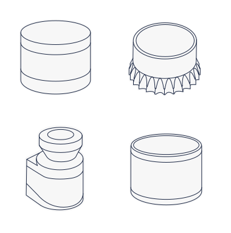

# Awesome LIDAR 

> A curated list of awesome LIDAR sensors and its applications.

[LIDAR](https://en.wikipedia.org/wiki/Lidar) is a remote sensing sensor that uses laser light to measure the surroundings in ~cm accuracy. The sensory data is usually referred as point cloud which means set of data points in 3D or 2D. The list contains hardwares, datasets, point cloud-processing algorithms, point cloud frameworks, simulators etc.

Contributions are welcome! Please [check out](contributing.md) our guidelines.

## Contents

- [Conventions](#conventions)
- [Manufacturers](#manufacturers)
- [Datasets](#datasets)
- [Libraries](#libraries)
- [Frameworks](#frameworks)
- [Algorithms](#algorithms)
  - [Basic matching algorithms](#basic-matching-algorithms)
  - [Semantic segmentation](#semantic-segmentation)
  - [Simultaneous localization and mapping SLAM and LIDAR-based odometry and or mapping LOAM](#simultaneous-localization-and-mapping-slam-and-lidar-based-odometry-and-or-mapping-loam)
  - [Object detection and object tracking](#object-detection-and-object-tracking)
- [Simulators](#simulators)
- [Related awesome](#related-awesome)
- [Others](#others)

## Conventions

- Any list item with an OctoCat :octocat: has a GitHub repo or organization
- Any list item with a RedCircle :red_circle: has YouTube videos or channel
- Any list item with a Paper :newspaper: has a scientific paper or detailed description

## Manufacturers

- [Velodyne](https://velodynelidar.com/) - Velodyne is a mechanical and solid-state LIDAR manufacturer. The headquarter is in San Jose, California, USA.
  - [YouTube channel :red_circle:](https://www.youtube.com/user/VelodyneLiDAR)
  - [ROS driver :octocat:](https://github.com/ros-drivers/velodyne)
- [Ouster](https://ouster.com/) - LIDAR manufacturer, specializing in digital-spinning LiDARs. Ouster is headquartered in San Francisco, USA.
  - [YouTube channel :red_circle:](https://www.youtube.com/c/Ouster-lidar)
  - [GitHub organization :octocat:](https://github.com/ouster-lidar)
- [Livox](https://www.livoxtech.com/) - LIDAR manufacturer.
  - [YouTube channel :red_circle:](https://www.youtube.com/channel/UCnLpB5QxlQUexi40vM12mNQ)
  - [GitHub organization :octocat:](https://github.com/Livox-SDK)
- [SICK](https://www.sick.com/ag/en/) - Sensor and automation manufacturer, the headquarter is located in Waldkirch, Germany.
  - [YouTube channel :red_circle:](https://www.youtube.com/user/SICKSensors)
  - [GitHub organization :octocat:](https://github.com/SICKAG)
- [Hokuyo](https://www.hokuyo-aut.jp/) - Sensor and automation manufacturer, headquartered in Osaka, Japan.
  - [YouTube channel :red_circle:](https://www.youtube.com/channel/UCYzJXC82IEy-h-io2REin5g)
- [Pioneer](http://autonomousdriving.pioneer/en/3d-lidar/) - LIDAR manufacturer, specializing in MEMS mirror-based raster scanning LiDARs (3D-LiDAR). Pioneer is headquartered in Tokyo, Japan.
  - [YouTube channel :red_circle:](https://www.youtube.com/user/PioneerCorporationPR)
- [Luminar](https://www.luminartech.com/) - LIDAR manufacturer focusing on compact, auto-grade sensors. Luminar is headquartered Palo Alto, California, USA.
  - [Vimeo channel :red_circle:](https://vimeo.com/luminartech)
  - [GitHub organization :octocat:](https://github.com/luminartech)
- [Hesai](https://www.hesaitech.com/) - Hesai Technology is a LIDAR manufacturer, founded in Shanghai, China.
  - [YouTube channel :red_circle:](https://www.youtube.com/channel/UCG2_ffm6sdMsK-FX8yOLNYQ/videos)
  - [GitHub organization :octocat:](https://github.com/HesaiTechnology)
- [Robosense](http://www.robosense.ai/) - RoboSense (Suteng Innovation Technology Co., Ltd.) is a LIDAR sensor, AI algorithm and IC chipset maufactuirer based in Shenzhen and Beijing (China).
  - [YouTube channel :red_circle:](https://www.youtube.com/channel/UCYCK8j678N6d_ayWE_8F3rQ)
  - [GitHub organization :octocat:](https://github.com/RoboSense-LiDAR)
- [Ibeo](https://www.ibeo-as.com/) - Ibeo Automotive Systems GmbH is an automotive industry / environmental detection laserscanner / LIDAR manufacturer, based in Hamburg, Germany.
  - [YouTube channel :red_circle:](https://www.youtube.com/c/IbeoAutomotive/)
- [Innoviz](https://innoviz.tech/) - Innoviz technologies / specializes in solid-state LIDARs.
  - [YouTube channel :red_circle:](https://www.youtube.com/channel/UCVc1KFsu2eb20M8pKFwGiFQ)
- [Quanenergy](https://quanergy.com/) - Quanenergy Systems / solid-state and mechanical LIDAR sensors / offers End-to-End solutions in Mapping, Industrial Automation, Transportation and Security. The headquarter is located in Sunnyvale, California, USA.
  - [YouTube channel :red_circle:](https://www.youtube.com/c/QuanergySystems)
- [Cepton](https://www.cepton.com/index.html) - Cepton (Cepton Technologies, Inc.) / pioneers in frictionless, and mirrorless design, self-developed MMT (micro motion technology) lidar technology. The headquarter is located in San Jose, California, USA.
  - [YouTube channel :red_circle:](https://www.youtube.com/channel/UCUgkBZZ1UWWkkXJ5zD6o8QQ)
- [Blickfeld](https://www.blickfeld.com/) - Blickfeld is a solid-state LIDAR manufacturer for autonomous mobility and IoT, based in München, Germany.
  - [YouTube channel :red_circle:](https://www.youtube.com/c/BlickfeldLiDAR)
  - [GitHub organization :octocat:](https://github.com/Blickfeld)
- [Neuvition](https://www.neuvition.com/) - Neuvition is a solid-state LIDAR manufacturer based in Wujiang, China.
  - [YouTube channel :red_circle:](https://www.youtube.com/channel/UClFjlekWJo4T5bfzxX0ZW3A)

## Datasets

- [Ford Dataset](https://avdata.ford.com/) - The dataset is time-stamped and contains raw data from all the sensors, calibration values, pose trajectory, ground truth pose, and 3D maps. The data is Robot Operating System (ROS) compatible.
  - [Paper :newspaper:](https://arxiv.org/pdf/2003.07969.pdf)
  - [GitHub repository :octocat:](https://github.com/Ford/AVData)
- [Audi A2D2 Dataset](https://www.a2d2.audi) - The dataset features 2D semantic segmentation, 3D point clouds, 3D bounding boxes, and vehicle bus data.
  - [Paper :newspaper:](https://www.a2d2.audi/content/dam/a2d2/dataset/a2d2-audi-autonomous-driving-dataset.pdf)
- [Waymo Open Dataset](https://waymo.com/open/) - The dataset contains independently-generated labels for lidar and camera data, not simply projections.
- [Oxford RobotCar](https://robotcar-dataset.robots.ox.ac.uk/) - The Oxford RobotCar Dataset contains over 100 repetitions of a consistent route through Oxford, UK, captured over a period of over a year. 
  - [YouTube channel :red_circle:](https://www.youtube.com/c/ORIOxfordRoboticsInstitute)
  - [Paper :newspaper:](https://robotcar-dataset.robots.ox.ac.uk/images/RCD_RTK.pdf)
- [EU Long-term Dataset](https://epan-utbm.github.io/utbm_robocar_dataset/) - This dataset was collected with our robocar (in human driving mode of course), equipped up to eleven heterogeneous sensors, in the downtown (for long-term data) and a suburb (for roundabout data) of Montbéliard in France. The vehicle speed was limited to 50 km/h following the French traffic rules.
- [NuScenes](https://www.nuscenes.org/) - Public large-scale dataset for autonomous driving.
  - [Paper :newspaper:](https://arxiv.org/pdf/1903.11027.pdf)
- [Lyft](https://level5.lyft.com/dataset/) - Public dataset collected by a fleet of Ford Fusion vehicles equipped with LIDAR and camera.
- [KITTI](http://www.cvlibs.net/datasets/kitti/raw_data.php) - Widespread public dataset, pirmarily focusing on computer vision applications, but also contains LIDAR point cloud.
- [Semantic KITTI](http://semantic-kitti.org/) - Dataset for semantic and panoptic scene segmentation.
  - [YouTube video :red_circle:](https://www.youtube.com/watch?v=3qNOXvkpK4I)
- [CADC - Canadian Adverse Driving Conditions Dataset](http://cadcd.uwaterloo.ca/) - Public large-scale dataset for autonomous driving in adverse weather conditions (snowy weather).
  - [Paper :newspaper:](https://arxiv.org/pdf/2001.10117.pdf)
- [UofTPed50 Dataset](https://www.autodrive.utoronto.ca/uoftped50) - University of Toronto, aUToronto's self-driving car dataset, which contains GPS/IMU, 3D LIDAR, and Monocular camera data. It can be used for 3D pedestrian detection.
  - [Paper :newspaper:](https://arxiv.org/pdf/1905.08758.pdf)
- [PandaSet Open Dataset](https://scale.com/open-datasets/pandaset) - Public large-scale dataset for autonomous driving provided by Hesai & Scale. It enables researchers to study challenging urban driving situations using the full sensor suit of a real self-driving-car.
- [Cirrus dataset](https://developer.volvocars.com/open-datasets/cirrus/) A public datatset from non-uniform distribution of LIDAR scanning patterns with emphasis on long range. In this dataset Luminar Hydra LIDAR is used. The dataset is available at the Volvo Cars Innovation Portal.
  - [Paper :newspaper:](https://arxiv.org/pdf/2012.02938.pdf)

## Libraries

- [Point Cloud Library (PCL)](http://www.pointclouds.org/) - Popular highly parallel programming library, with numerous industrial and research use-cases. 
  - [GitHub repository :octocat:](https://github.com/PointCloudLibrary/pcl)
- [Open3D library](http://www.open3d.org/docs/release/) - Open3D library contanins 3D data processing and visualization algorithms. It is open-source and supports both C++ and Python.
  - [GitHub repository :octocat:](https://github.com/intel-isl/Open3D)
  - [YouTube channel :red_circle:](https://www.youtube.com/channel/UCRJBlASPfPBtPXJSPffJV-w)
- [PyTorch Geometric :newspaper:](https://arxiv.org/pdf/1903.02428.pdf) - A geometric deep learning extension library for PyTorch.
  - [GitHub repository :octocat:](https://github.com/rusty1s/pytorch_geometric)
- [PyTorch3d](https://pytorch3d.org/) - PyTorch3d is a library for deep learning with 3D data written and maintained by the Facebook AI Research Computer Vision Team.
  - [GitHub repository :octocat:](https://github.com/facebookresearch/pytorch3d)
- [Kaolin](https://kaolin.readthedocs.io/en/latest/) - Kaolin is a PyTorch Library for Accelerating 3D Deep Learning Research written by NVIDIA Technologies for game and application developers.
  - [GitHub repository :octocat:](https://github.com/NVIDIAGameWorks/kaolin/)
  - [Paper :newspaper:](https://arxiv.org/pdf/1911.05063.pdf)
- [PyVista](https://docs.pyvista.org/) - 3D plotting and mesh analysis through a streamlined interface for the Visualization Toolkit.
  - [GitHub repository :octocat:](https://github.com/pyvista/pyvista)
  - [Paper :newspaper:](https://joss.theoj.org/papers/10.21105/joss.01450)
- [pyntcloud](https://pyntcloud.readthedocs.io/en/latest/) - Pyntcloud is a Python 3 library for working with 3D point clouds leveraging the power of the Python scientific stack.
  - [GitHub repository :octocat:](https://github.com/daavoo/pyntcloud)

## Frameworks

- [Autoware](https://www.autoware.ai/) - Popular framework in academic and research applications of autonomous vehicles.
  - [GitLab repository :octocat:](https://gitlab.com/autowarefoundation/autoware.ai)
  - [Paper :newspaper:](https://www.researchgate.net/profile/Takuya_Azumi/publication/327198306_Autoware_on_Board_Enabling_Autonomous_Vehicles_with_Embedded_Systems/links/5c9085da45851564fae6dcd0/Autoware-on-Board-Enabling-Autonomous-Vehicles-with-Embedded-Systems.pdf)
- [Baidu Apollo](https://apollo.auto/) - Apollo is a popular framework which accelerates the development, testing, and deployment of Autonomous Vehicles.
  - [GitHub repository :octocat:](https://github.com/ApolloAuto/apollo)
  - [YouTube channel :red_circle:](https://www.youtube.com/c/ApolloAuto)

## Algorithms

### Basic matching algorithms
- [Iterative closest point :red_circle:](https://www.youtube.com/watch?v=uzOCS_gdZuM) - The must-have algorithm for feature matching applications (ICP).
- [Normal distributions transform :red_circle:](https://www.youtube.com/watch?v=0YV4a2asb8Y) - More recent massively-parallel approach to feature matching (NDT).

### Semantic segmentation
- [RangeNet++ :newspaper:](https://www.ipb.uni-bonn.de/wp-content/papercite-data/pdf/milioto2019iros.pdf) - Fast and Accurate LiDAR Sematnic Segmentation with fully convolutional network.
  - [GitHub repository :octocat:](https://github.com/PRBonn/rangenet_lib)
  - [YouTube video :red_circle:](https://www.youtube.com/watch?v=uo3ZuLuFAzk)
- [PolarNet :newspaper:](https://arxiv.org/pdf/2003.14032.pdf) - An Improved Grid Representation for Online LiDAR Point Clouds Semantic Segmentation.
  - [GitHub repository :octocat:](https://github.com/edwardzhou130/PolarSeg)
  - [YouTube video :red_circle:](https://www.youtube.com/watch?v=iIhttRSMqjE)
- [Frustum PointNets :newspaper:](https://arxiv.org/pdf/1711.08488.pdf) - Frustum PointNets for 3D Object Detection from RGB-D Data.
  - [GitHub repository :octocat:](https://github.com/charlesq34/frustum-pointnets)
- [Study of LIDAR Semantic Segmentation](https://larissa.triess.eu/scan-semseg/) - Scan-based Semantic Segmentation of LiDAR Point Clouds: An Experimental Study IV 2020.
  - [Paper :newspaper:](https://arxiv.org/abs/2004.11803)
  - [GitHub repository :octocat:](http://ltriess.github.io/scan-semseg)

### Simultaneous localization and mapping SLAM and LIDAR-based odometry and or mapping LOAM
- [LOAM J. Zhang and S. Singh :red_circle:](https://youtu.be/8ezyhTAEyHs) - LOAM: Lidar Odometry and Mapping in Real-time.
- [LeGO-LOAM :octocat:](https://github.com/RobustFieldAutonomyLab/LeGO-LOAM) - A lightweight and ground optimized lidar odometry and mapping (LeGO-LOAM) system for ROS compatible UGVs. 
  - [YouTube video :red_circle:](https://www.youtube.com/watch?v=7uCxLUs9fwQ)
- [Cartographer :octocat:](https://github.com/cartographer-project/cartographer) - Cartographer is ROS compatible system that provides real-time simultaneous localization and mapping (SLAM) in 2D and 3D across multiple platforms and sensor configurations.
  - [YouTube video :red_circle:](https://www.youtube.com/watch?v=29Knm-phAyI)
- [SuMa++ :newspaper:](http://www.ipb.uni-bonn.de/wp-content/papercite-data/pdf/chen2019iros.pdf) - LiDAR-based Semantic SLAM.
  - [GitHub repository :octocat:](https://github.com/PRBonn/semantic_suma/)
  - [YouTube video :red_circle:](https://youtu.be/uo3ZuLuFAzk)
- [OverlapNet :newspaper:](http://www.ipb.uni-bonn.de/wp-content/papercite-data/pdf/chen2020rss.pdf) -  Loop Closing for LiDAR-based SLAM.
  - [GitHub repository :octocat:](https://github.com/PRBonn/OverlapNet)
  - [YouTube video :red_circle:](https://www.youtube.com/watch?v=YTfliBco6aw)
- [LIO-SAM :newspaper:](https://arxiv.org/pdf/2007.00258.pdf) - Tightly-coupled Lidar Inertial Odometry via Smoothing and Mapping.
  - [GitHub repository :octocat:](https://github.com/TixiaoShan/LIO-SAM)
  - [YouTube video :red_circle:](https://www.youtube.com/watch?v=A0H8CoORZJU)

### Object detection and object tracking
- [Learning to Optimally Segment Point Clouds :newspaper:](https://arxiv.org/abs/1912.04976) - By Peiyun Hu, David Held, and Deva Ramanan at Carnegie Mellon University. IEEE Robotics and Automation Letters, 2020.
  - [YouTube video :red_circle:](https://www.youtube.com/watch?v=wLxIAwIL870)
  - [GitHub repository :octocat:](https://github.com/peiyunh/opcseg)
- [Leveraging Heteroscedastic Aleatoric Uncertainties for Robust Real-Time LiDAR 3D Object Detection :newspaper:](https://arxiv.org/pdf/1809.05590.pdf) - By Di Feng, Lars Rosenbaum, Fabian Timm, Klaus Dietmayer. 30th IEEE Intelligent Vehicles Symposium, 2019.
  - [YouTube video :red_circle:](https://www.youtube.com/watch?v=2DzH9COLpkU)
- [What You See is What You Get: Exploiting Visibility for 3D Object Detection :newspaper:](https://arxiv.org/pdf/1912.04986.pdf) - By Peiyun Hu, Jason Ziglar, David Held, Deva Ramanan, 2019.
  - [YouTube video :red_circle:](https://www.youtube.com/watch?v=497OF-otY2k)
  - [GitHub repository :octocat:](https://github.com/peiyunh/WYSIWYG)

## Simulators
- [CoppeliaSim](https://www.coppeliarobotics.com/coppeliaSim) - Cross-platform general-purpose robotic simulator (formerly known as V-REP).
  - [YouTube channel :red_circle:](https://www.youtube.com/user/VirtualRobotPlatform)
- [OSRF Gazebo](http://gazebosim.org/) - OGRE-based general-purpose robotic simulator, ROS/ROS2 compatible.
  - [GitHub repository :octocat:](https://github.com/osrf/gazebo)
- [CARLA](https://carla.org/) - Unreal Engine based simulator for automotive applications. Compatible with Autoware, Baidu Apollo and ROS/ROS2.
  - [GitHub repository :octocat:](https://github.com/carla-simulator/carla)
  - [YouTube channel :red_circle:](https://www.youtube.com/channel/UC1llP9ekCwt8nEJzMJBQekg)
- [LGSVL](https://www.lgsvlsimulator.com/) - Unity Engine based simulator for automotive applications. Compatible with Autoware, Baidu Apollo and ROS/ROS2.
  - [GitHub repository :octocat:](https://github.com/lgsvl/simulator)
  - [YouTube channel :red_circle:](https://www.youtube.com/c/LGSVLSimulator)
- [AirSim](https://microsoft.github.io/AirSim) - Unreal Engine based simulator for drones and automotive. Compatible with ROS.
  - [GitHub repository :octocat:](https://github.com/microsoft/AirSim)
  - [YouTube video :red_circle:](https://www.youtube.com/watch?v=gnz1X3UNM5Y)

## Related awesome
- [Awesome point cloud analysis :octocat:](https://github.com/Yochengliu/awesome-point-cloud-analysis#readme)
- [Awesome robotics :octocat:](https://github.com/Kiloreux/awesome-robotics#readme)
- [Awesome robotics libraries :octocat:](https://github.com/jslee02/awesome-robotics-libraries#readme)
- [Awesome ROS2 :octocat:](https://github.com/fkromer/awesome-ros2#readme)
- [Awesome artificial intelligence :octocat:](https://github.com/owainlewis/awesome-artificial-intelligence#readme)
- [Awesome computer vision :octocat:](https://github.com/jbhuang0604/awesome-computer-vision#readme)
- [Awesome machine learning :octocat:](https://github.com/josephmisiti/awesome-machine-learning#readme)
- [Awesome deep learning :octocat:](https://github.com/ChristosChristofidis/awesome-deep-learning#readme)
- [Awesome reinforcement learning :octocat:](https://github.com/aikorea/awesome-rl/#readme)
- [Awesome SLAM datasets :octocat:](https://github.com/youngguncho/awesome-slam-datasets#readme)
- [Awesome electronics :octocat:](https://github.com/kitspace/awesome-electronics#readme) 
- [Awesome vehicle security and car hacking :octocat:](https://github.com/jaredthecoder/awesome-vehicle-security#readme)

## Others
- [Pointcloudprinter :octocat:](https://github.com/marian42/pointcloudprinter) - A tool to turn point cloud data from aerial lidar scans into solid meshes for 3D printing.
- [Pcx :octocat:](https://github.com/keijiro/Pcx) - Point cloud importer/renderer for Unity.
- [Bpy :octocat:](https://github.com/uhlik/bpy) - Point cloud importer/renderer/editor for Blender, Point Cloud visualizer.
- [Semantic Segmentation Editor :octocat:](https://github.com/Hitachi-Automotive-And-Industry-Lab/semantic-segmentation-editor) - Point cloud and image semantic segmentation editor by Hitachi Automotive And Industry Laboratory, point cloud annotator / labeling.
- [3D Bounding Box Annotation Tool :octocat:](https://github.com/walzimmer/3d-bat) - 3D BAT: A Semi-Automatic, Web-based 3D Annotation Toolbox for Full-Surround, Multi-Modal Data Streams, point cloud annotator / labeling.
  - [Paper :newspaper:](https://arxiv.org/pdf/1905.00525.pdf)
  - [YouTube video :red_circle:](https://www.youtube.com/watch?v=gSGG4Lw8BSU)
- [Photogrammetry importer :octocat:](https://github.com/SBCV/Blender-Addon-Photogrammetry-Importer) - Blender addon to import reconstruction results of several libraries.
